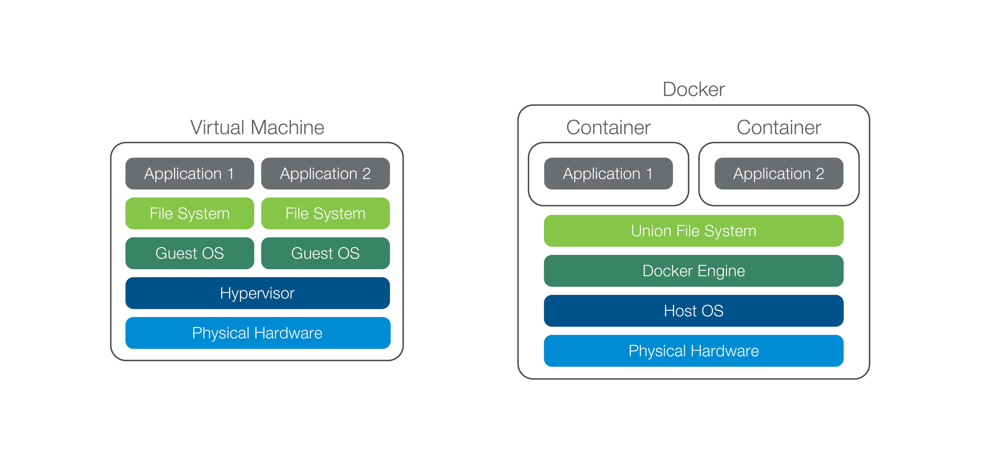
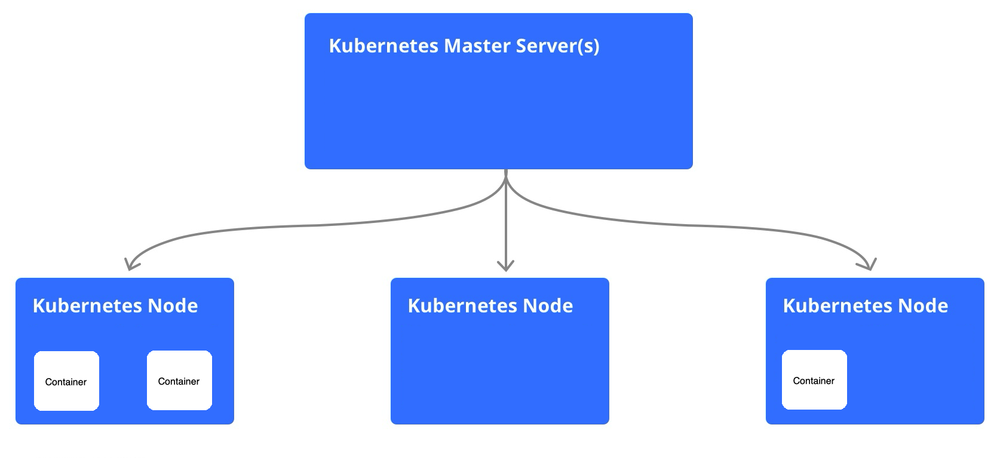
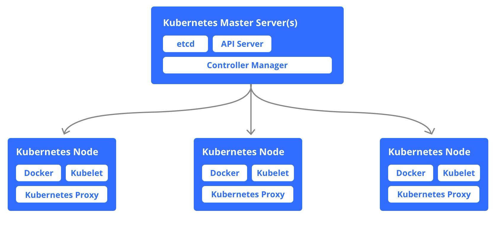

# **Kubernetes Workshop**

https://github.com/jonakoudijs/citrus-workshop

---

# Wat is een container?

- Lichtgewicht, geïsoleerde omgeving voor applicaties
- Bevat alles wat nodig is om een app te draaien
- Consistent gedrag op elke omgeving
- Een image is een blauwdruk voor containers

  

> https://www.docker.com/resources/what-container

<!-- Containers zorgen ervoor dat een applicatie altijd hetzelfde werkt, ongeacht laptop, server. -->
<!-- Dit maakt ze ideaal voor moderne softwareontwikkeling. -->

---

# Verschil VM en Container

---

# Waarom Kubernetes?

- Automatische schaalbaarheid en herstel
- Efficiënt beheer van containers

<!-- Het zorgt ervoor dat applicaties automatisch kunnen schalen en herstellen bij fouten. -->
<!-- Zie het als een dirigent die je instructies geeft en die vervolgens constant jouw eindresultaat probeert uit te voeren. -->

---

# Wat is een Kubernetes cluster?

- Bestaat uit een Control Plane (Master) en Worker Nodes
- Control Plane: regelt en coördineert alles
- Worker Nodes: draaien de containers
- Controllers: bewaken en sturen bij

---

# Control Plane + Workers

---

# Cluster componenten

<!-- Op elke master en worker node zijn een aantal processen verantwoordelijk voor een stukje van Kubernetes. -->

---
# Kubernetes objecten

- Pod
- Ingress
- Service
- Deployment
- Configmap / Secret
- Namespace

<!-- Pod: 1 of meerdere containers -->
<!-- Ingress: regelt toegang van buitenaf (bijv. via HTTP) -->
<!-- Service: maakt communicatie naar en tussen containers mogelijk -->
<!-- Deployment: definieert hoe en hoeveel containers moeten draaien -->
<!-- ConfigMap & Secret: beheren configuratie en gevoelige data -->
<!-- Namespace: logische verdeling van Kubernetes objecten. Scheiding van teams en verschillende omgevingen. -->